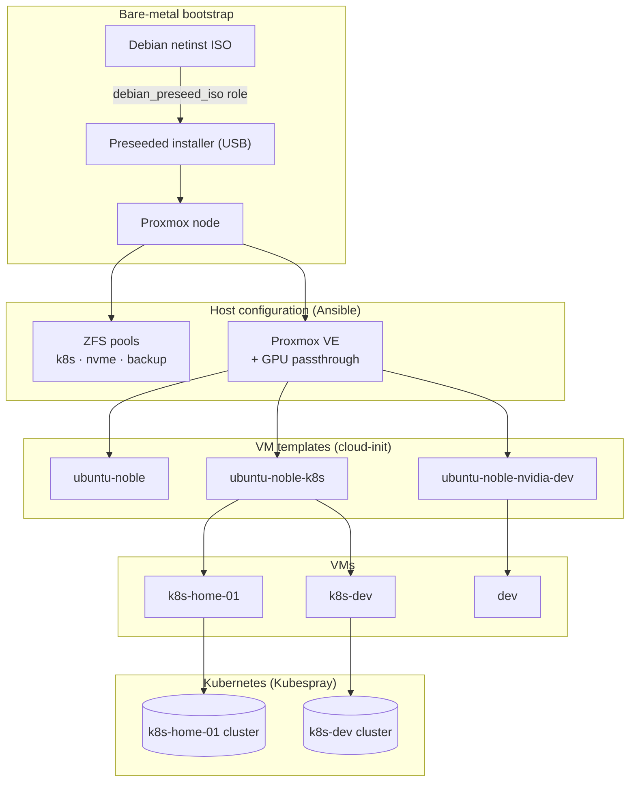

# Homelab Proxmox: Infrastructure as Code

[](https://github.com/srkn0/homelab-proxmox/actions/workflows/lint.yml)
[](LICENSE)


End-to-end, reproducible automation for a single-node **Proxmox VE** homelab, from
a bare machine all the way to running **Kubernetes** clusters. Everything is
declarative: a preseeded Debian installer bootstraps the host, Ansible configures
ZFS storage and Proxmox (including GPU passthrough), cloud-init builds VM templates,
and Kubespray turns the resulting VMs into clusters.

## What this project demonstrates

- **Infrastructure as Code** with Ansible: custom, reusable roles with sane defaults
  and idempotent tasks (existing resources are detected and skipped).
- **Bare-metal provisioning**: a parameterized Debian *preseed* ISO builder, packaged
  as its own Ansible role.
- **Storage engineering**: ZFS pool topology (striped mirrors, NVMe, backup HDD) with
  tuned ARC and per-dataset properties.
- **Virtualization**: Proxmox VE setup with PCIe/IOMMU **GPU passthrough** (RTX 3060).
- **Kubernetes**: repeatable cluster bootstrap and upgrades via Kubespray, driven by
  a `Taskfile`.
- **Quality automation**: `yamllint` + `ansible-lint` (production profile) enforced in
  CI and via pre-commit.
- **Dependency automation**: Renovate keeps roles, actions and the Kubespray version
  current; a custom workflow merges the upstream Kubespray sample `group_vars` into each
  bump PR and posts the release notes, so upgrades are reviewable in one place.

## Architecture



## Repository layout

```
.
├── playbooks/                       # entry-point playbooks (one per provisioning step)
├── roles/
│   ├── debian_preseed_iso/          # build a preseeded Debian installer ISO
│   ├── proxmox_cloudinit_template/  # build Proxmox VM templates from Ubuntu cloud images
│   ├── proxmox_vm/                  # clone VMs from those templates
│   ├── lae.proxmox/                 # external (ansible-galaxy, gitignored)
│   └── mrlesmithjr.zfs/             # external (ansible-galaxy, gitignored)
├── inventory/
│   ├── proxmox/                     # the Proxmox host
│   └── kubespray/                   # per-cluster Kubespray inventories
├── scripts/                         # dependency-bump helpers (kubespray + role diffs)
├── .github/workflows/               # CI linting + dependency-bump automation
├── .renovaterc.json5                # Renovate dependency updates
├── Taskfile.yaml                    # Kubespray bootstrap/upgrade/kubeconfig tasks
├── requirements.yml                 # pinned external role versions
└── ansible.cfg
```

## Hardware

A single node (and probably all it will ever need):

| Component | Spec |
|---|---|
| CPU | Intel i5-10600K |
| RAM | 64 GB DDR4 Crucial 2666 MHz |
| Mainboard | Gigabyte Z490 UD |
| GPU | RTX 3060 (reserved for future GPU workloads) |
| System disk | 1× Crucial SSD 256 GB |
| ZFS pool `k8s` | 4× Samsung EVO 500 GB → two mirror vdevs (striped mirror) |
| ZFS pool `vms` | 1× M.2 NVMe 1 TB |
| ZFS pool `backup` | 1× Seagate 2 TB HDD |
| PSU / Case | be quiet! 500 W / Chieftec UK-02B-OP cube |

> The four Samsung SSDs live in a 5.25" hot-swap bay with a 4× 2.5" SATA backplane.

## Prerequisites

- A control machine with Ansible and [`go-task`](https://taskfile.dev) (managed here
  via [`mise`](https://mise.jdx.dev), see `mise.toml`).
- SSH access to the target host as `root` (the inventory points at the Proxmox node).
- Install the external role dependencies first:

  ```bash
  ansible-galaxy install -r requirements.yml -p ./roles
  ```

## Usage

The steps below follow the provisioning flow in the architecture diagram.

### 0. (Optional) Build the preseeded installer ISO

```bash
ansible-playbook playbooks/build_preseed_iso.yml \
  -e input_iso=/path/to/debian-13.x.x-amd64-netinst.iso \
  -e output_iso=/path/to/preseed-debian-13.x.x-amd64-netinst.iso
```

See [`roles/debian_preseed_iso`](roles/debian_preseed_iso) for all options. Write the
resulting ISO to a USB stick and install the host with it.

### 1. Configure ZFS pools

```bash
ansible-playbook -i inventory/proxmox/inventory.ini playbooks/setup_zfs.yml
```

### 2. Install & configure Proxmox VE

```bash
ansible-playbook -i inventory/proxmox/inventory.ini playbooks/install_proxmox.yml
```

### 3. Build cloud-init VM templates

```bash
ansible-playbook -i inventory/proxmox/inventory.ini playbooks/setup_cloudinit_templates.yml
```

### 4. Create VMs

```bash
ansible-playbook -i inventory/proxmox/inventory.ini playbooks/create_k8s_vms.yml   # Kubernetes VMs
ansible-playbook -i inventory/proxmox/inventory.ini playbooks/create_dev_vm.yml    # NVIDIA/AI dev VM
```

### 5. Bootstrap a Kubernetes cluster (Kubespray)

`$CLUSTER` is the folder name of the inventory under `inventory/kubespray/$CLUSTER`.

```bash
task bootstrap-k8s-cluster -- $CLUSTER
task get-kubeconfig -- $CLUSTER          # fetch kubeconfig from the first control plane
```

### Upgrade a Kubernetes cluster

- Bump `KUBESPRAY_VERSION` in `Taskfile.yaml` first.
- Check the [Kubespray docs](https://github.com/kubernetes-sigs/kubespray) for that
  version; `$KUBE_VERSION` must be supported by the Kubespray image in use.

```bash
task upgrade-k8s-cluster -- $CLUSTER $KUBE_VERSION
```

## Operational notes

### Node power tweaks

```bash
apt install powertop -y && powertop --auto-tune
echo powersave | sudo tee /sys/devices/system/cpu/cpu*/cpufreq/scaling_governor
```

### Tailscale subnet router

Community helper scripts:
[Debian LXC](https://community-scripts.github.io/ProxmoxVE/scripts?id=debian) ·
[add Tailscale to LXC](https://community-scripts.github.io/ProxmoxVE/scripts?id=add-tailscale-lxc)

```bash
echo 'net.ipv4.ip_forward = 1' | sudo tee -a /etc/sysctl.d/99-tailscale.conf
echo 'net.ipv6.conf.all.forwarding = 1' | sudo tee -a /etc/sysctl.d/99-tailscale.conf
sudo sysctl -p /etc/sysctl.d/99-tailscale.conf
# advertise the Traefik / MetalLB load-balancer IP
sudo tailscale set --advertise-routes=192.168.178.201/32
```

## Dependency automation

[Renovate](https://docs.renovatebot.com) (config in `.renovaterc.json5`) keeps the
moving parts current: the external Ansible roles in `requirements.yml`, the GitHub
Actions, the pre-commit hooks, and the Kubespray version pinned in `Taskfile.yaml`
(mapped to the `quay.io/kubespray/kubespray` image via a custom manager).

Kubespray upgrades get special treatment. The per-cluster `group_vars` are customized
copies of kubespray's upstream sample, whose defaults drift between releases. When
Renovate opens a Kubespray bump PR, `.github/workflows/kubespray-sample-merge.yml`:

- 3-way merges the upstream sample delta (old version to new version) into the
  customized `group_vars`, so only the upstream changes surface, with conflict markers
  where a customization overlaps; and
- posts a single PR comment with the kubespray release notes for every version in
  between, newest first.

External role bumps (`lae.proxmox`, `mrlesmithjr.zfs`) get a comparable comment via
`.github/workflows/role-bump-notes.yml`: it diffs the role's `defaults/main.yml`
between versions and flags which of the variables you set are removed, renamed, or
have a changed default.

Reconciling the result stays a manual review step.

## License

[MIT](LICENSE) © srkn0
